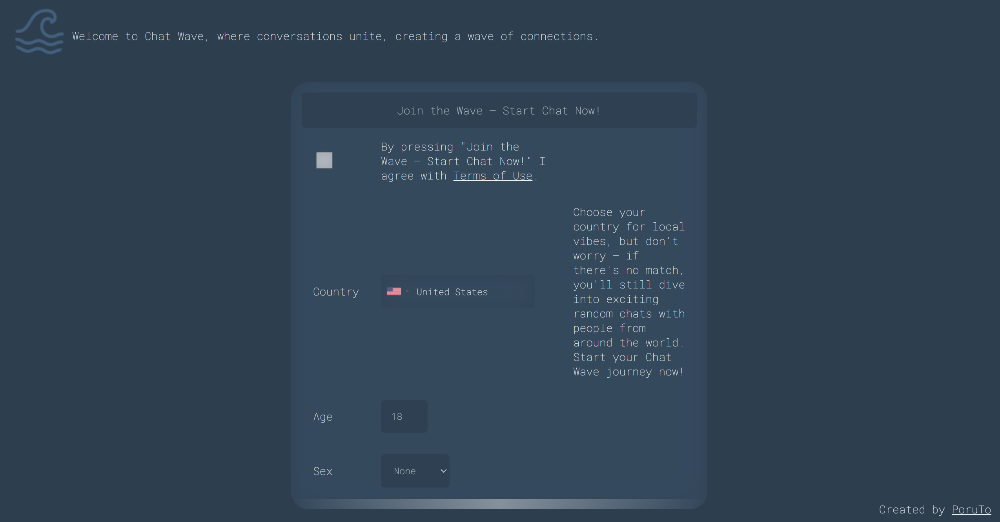
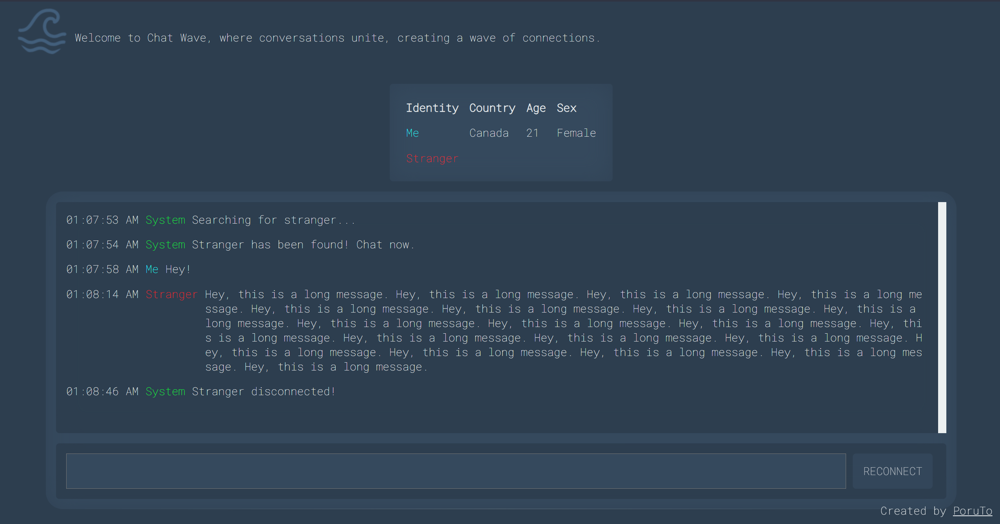

# web-flask-chat-wave

It's just a 2 days project I've done for fun.
 
Welcome to Chat Wave, a platform designed for spontaneous and serendipitous conversations, reminiscent of the popular service Omegle. Our project aims to connect individuals with random people, fostering unique and unexpected interactions in real-time.

How It Works:
Chat Wave provides users with the opportunity to engage in random conversations with others from around the world. Much like striking up a conversation with a stranger, this platform adds an element of excitement and surprise to online interactions.

Screenshot 1

Screenshot 2

